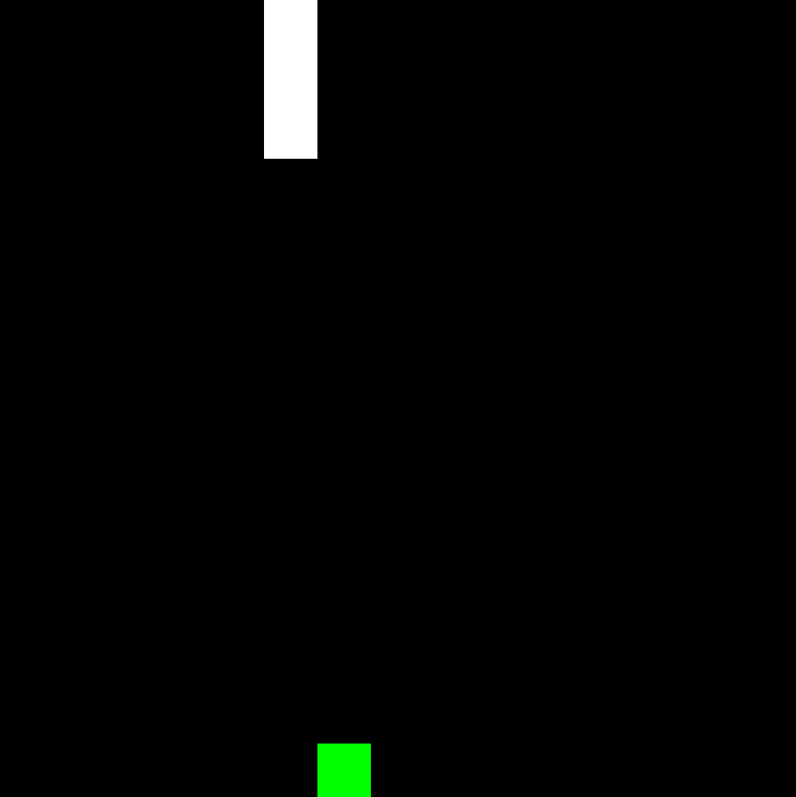

[](https://docs.rs/snake-rs)
[](https://crates.io/crates/snake-rs)

# snake

A library to handle the logic for the classic game snake.



## Usage

```toml
[dependencies]
snake-rs = "0.1.1"
```

Initialize with `new` and use `turn` to progress a game step. An example is in [game.rs](examples/game.rs).

Game without display
```rust
use snake::{Snake, Direction};
let mut game = Snake::new(0, 10);

game.turn(Direction::Down);
```

You can use the `display` feature flag to have a window displaying the game. This requires
[csfml](https://www.sfml-dev.org/download/csfml) to be installed.

Game with display
```rust
use snake::{Direction, RenderWindow, Snake, Style};
let window = RenderWindow::new((1000, 1000), "Snake", Style::CLOSE, &Default::default());
let mut game = Snake::new_display(0, 15, Some(window));
```

### Installing CSFML
Arch:
```sh
sudo pacman -Syu csfml
```
Ubuntu:
```sh
sudo apt-get install libcsfml
```


```
git clone https://github.com/jspspike/snake
cd snake
cargo run --example game --features display
```
